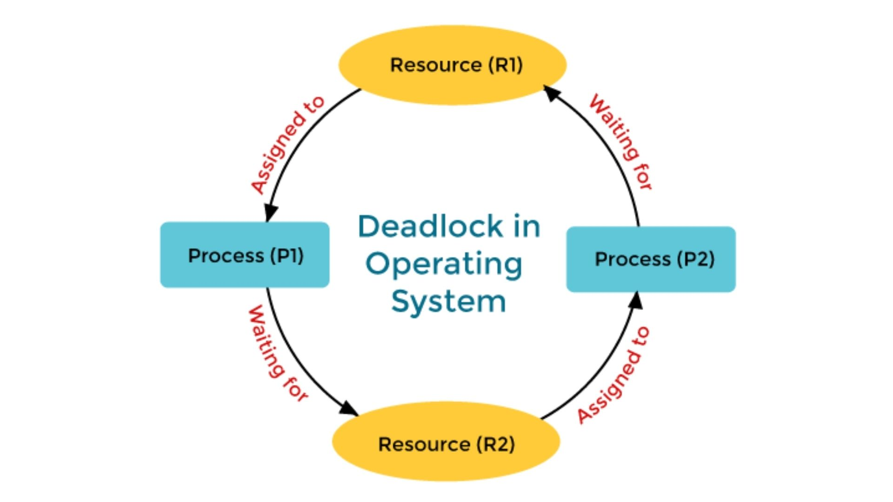

# PHILOSOPHER [Mandatory](../philosopher_sub.pdf)

##### 📍❗️ I strongly advise against simply taking this repository. understanding it, and then pushing it. At the very least, try to write something of your own befor considering that. Use this repository as a reference only, nothing more ❗️📍

## TASKS

> #### 1. What we should to do ? [ℹ️](#1-what-we-should-to-do-)
> #### 2. Learn [ℹ️](#2-learn)
> #### 3. Program work strategy and start coding ;) [ℹ️](#3-program-work-strategy-and-start-coding-)

## 1. What we should to do ?
first we need to know what we should to do it , we can't work without this !.
Okey , let's starting with the [subject](../philosopher_sub.pdf). We need to build a program inspired by <mark>Dining Philosopher Problem</mark> [ℹ️](#philosopher). The program should accept four or five args
`[number of philosopher] [time to die] [time to sleep] [time to die] '[number of meals]'`, time in milliseconds, and the output is most be like this :
```
[time after program run in ms]    [philo id] has taken a fork
[time after program run in ms]    [philo id] is eating
[time after program run in ms]    [philo id] is sleeping
[time after program run in ms]    [philo id] is thinking
[time after program run in ms]    [philo id] die
```
- each philosopher should be a thread.
- There is one fork between each pair of philosophers. Therefore, if there are several philosophers, each philosopher has a fork on their left side and a fork on their right side. If there is only one philosopher, there should be only one fork on the table.
- To prevent philosophers from duplicating forks, you should protect the forks state with a mutex for each of them.

##### Allowed Functions :
`memset`, `printf`, `malloc`, `free`, `write`,
`usleep`, `gettimeofday`, `pthread_create`, `pthread_detach`, `pthread_join`, `pthread_mutex_init`, `pthread_mutex_destroy`, `pthread_mutex_lock`, `pthread_mutex_unlock`

A displayed state message should not be mixed up with another message and
### **<mark>Your program must not have any [data races](#data_races)!!!!!!!</mark>**
I recommend reading the subject for full understanding of the requirements and rules
[mandatory](../.img/mandatory.png)

## 2. Learn

* Through [what we should to do](#1-what-we-should-to-do-), we need to learn and become familiar with several concepts, and among the most important are:
    - **1 -> What is the dining philosopher problem ?**
    - **2 -> What is thread ?**
    - **3 -> What is Mutex ?**
    - **4 -> How to work with time in C ?**
    - **5 -> Breakdown the allowed functions**

#### 1. What is the dining philosopher problem ?

##### 1/1. Dining Philosopher Problem:

- The dining philosopher problem is an example problem '**at the operating systems level**' often used in concurrent algorithm design to illustrate synchronization issues and techniques for resolving them.
it's talks about five philosophers sitting around a round table. Each philosopher has one fork, and in the middle of the table there is a plate of spaghetti. In order for a philosopher to eat, he must borrow the fork of the philosopher next to him. This brings us to a new concept: **Deadlock**
- Each philosopher can eat, then sleep, then think. They share the time for sleeping, eating, and the time at which one might die from starvation.
[source](https://en.wikipedia.org/wiki/Dining_philosophers_problem)

##### 1/2. Deadlock:
- Deadlock is a situation where a set of processes is blocked because each process is holding a resource and waiting for another resource acquired by some other process.

#### 2. What is thread ?

##### 2/1. What is thread and its relation to the process:
- Thread is a single sequence stream within a process. Threads are also called lightweight processes as they possess some of the properties of processes. Each thread belongs to exactly one process.
- There is **<mark>no process that does not contain at least one thread</mark>**. The thread is responsible for running the program - calculation, functions, etc. What we used to think the process was responsible for is actually handled by the thread. The process is merely a container for the thread, providing it with resources such as memory.
- When a program starts, the operating system creates a process, and automatically starts one thread to run its `main()` function.
- That main thread is responsible for executing all the code, including function calls, loops, etc.
- This is why even single-threaded programs are still multi-component: **<mark>the process is the container, and the thread is the worker</mark>**.
- A single process can contain many threads, prvided that it does not exceed the maximum limit set by the system kernel, you can see it with this command:
```
ulimit -s          # thread stack size
ulimit -u          # max user processes (threads count too)
```
- Threads can easily share data with each other. This brings us to a new concept: **race conditions** or **data races** [here](#22-data-races)
##### 2/2. how to create miltiple threads in C ?
- To create threads in C, there lib call it `<pthread.h>`, it's contine all function you need it to create or manage the threads in C. But you should to add `-pthread` flag to the compiler, to know that the program will create and work with several threads in addition to the main thread. "in some OS you don't need add this flag"
- The function responsible for creating a new thread is `pthread_create()`
```C
				int	pthread_create(pthread_t *thread, const pthread_attr_t *attr, void *(*start_routine)(void *), void *arg);
								    |				  |				|	     |
                    A pointer to a pthread_t 			    |				  |				|	     |___________ void to arg it will
		    variable where the function will		    |				  |				|			pass it to new thread.
		    store the identifier of the 		    |				  |				|__ pointer to function, it will be
                    newly created thread. This _____________________|				  |				       run it by the new thread.
                    identifier can be used for							  |
                    subsequent operations on the			A pointer to a pthread_attr_t structure that specifies
                    thread, such as joining or canceling.		attributes for the new thread, such as stack size,
									scheduling policy, and detach state. If set to NULL,
									the thread is created with default attributes.

```
this is simple example:
```C
#include <stdio.h>
#include <pthread.h>
#include <sys/time.h>
void    print_from_thread(void *args)
{
    int id;

    id = (int) args;
    printf("hi form thread id %d\n", id);
    sleep(2);
    printf("good bay from thread id %d\n", id);
}

int main()
{
    int i;
    pthread_t   thread[2];

    i = 0;
    while (i < 2)
    {
        pthread_create(&thread[i], NULL, (void *)print_from_thread, (void *)i);
        i++;
    }
    sleep(5); // wait from each thread to finish execution ; 2 + 2 = 4, plus one scond to be safe
    printf("main thread is finish\n");
}
```
output is something like this:
```
hi form thread id 0
hi form thread id 1
good bay from thread id 0
good bay from thread id 1
main thread is finish
```
- Why we should to wait each thread to finish execution than can the main thread continue?
    * You should wait for each thread to finish because if the main thread exits, the entire process (and all its threads) is terminated. The OS manages all threads, but if you don’t explicitly wait for them, the process might end too soon — killing active threads.
    * Killing threads before they finish their work causes many problems, the worst of which is resource **leaks 'metadata thread' or zombie thread**.
    * So how we can wait all threads to finish without use `sleep()`. There a two functions can fix that, the first one is `pthread_join()` it told the main thread to wait each thread to finish execution.
    ```C
				int pthread_join(pthread_t thread, void **value_ptr);
							      |		       |
		pthread_t variable when			      |		       |___________ the return value from the thread
		store the identifier about the thread ________|
    ```
    `pthread_detach()` it make the threads run separately from the main thread. You can't return data from detach thread or join it. The main thread doesn't wait, if the main thread ends the threads that weremade to run separately also end but without leaks on ***'metadata thread' or zombie thread***.
    ```C
				int pthread_detach(pthread_t thread);
								|_________ pthread_t variable when store the identifier about the thread.
    ```
##### 2/2. Data Races:
- Data Races is a type of bug that occurs in concurrent systems when the behavior of software depends on the sequence or timing of uncontrollable events such as thread execution order. It happens when two or more threads (or processes) access shared data and try to change it simultaneously.
- So we need to prevent this bug from occurring in our program, but how can we do that?. With help next topic **'Mutex'**.

#### 3. What is Mutex ?
##### 3/1. Mutex:
- Mutex is a locking mechanism, it protects the program from data races, by locking one area ("**Critical Section**") or variable from all threads and allowing one thread to access to it. It don't allow the other threads to access it until that thread has finished with it.
- There are functions in same lib of create threads `<pthread.h>`, this functions can we use it to work with Mutex.
    * `pthread_mutex_init()`: First we need to define a variable as a Mutex lock. `pthread_mutex_init()` it's do that.
    ```C
                        int pthread_mutex_init(pthread_mutex_t *mutex, const pthread_mutexattr_t *attr);
                                                                  |                                 |
    Variable to define it as Mutex lock __________________________|                                 |________ struct that defines special attributes for the mutex.
    ```
    you can search more about the attributes. We need to use the default attribute witch we need to put NULL in it.
    * `pthread_mutex_destroy()`: After working with mutex in your program you should to destroy all define variables, the `pthread_mutex_destroy()` do that.
    ```C
                            int pthread_mutex_destroy(pthread_mutex_t *mutex);
                                                                         |
        Variable to Undefine it as Mutex lock ___________________________|
    ```
    * `pthread_mutex_lock()`: To protect variable or the critical section we need to lock it, `pthread_mutex_lock()` function do that.
    ```C
                            int pthread_mutex_lock(pthread_mutex_t *mutex);
                                                                      |
        Variable to lock by it _______________________________________|
    ```
    * `pthread_mutex_unlock()`: After lock we need to unlock it, to allow anther thread to work with it. `pthread_mutex_unlock()` function do that.
    ```C
                            int pthread_mutex_unlock(pthread_mutex_t *mutex);
                                                                        |
        Variable to unlock by it _______________________________________|
    ```
Example:
```C
#include <stdio.h>
#include <pthread.h>
#include <unistd.h>

pthread_mutex_t mutex;

void    *print_from_thread(void *args)
{
    int id;

    id = (int) args;
    pthread_mutex_lock(&mutex);
    printf("hi form thread id %d\n", id);
    sleep(2);
    printf("good bay from thread id %d\n", id);
    pthread_mutex_unlock(&mutex);
}

int main()
{
    int i;
    pthread_t   thread[2];

    i = 0;
    pthread_mutex_init(&mutex, NULL);
    while (i < 2)
    {
        pthread_create(&thread[i], NULL, (void *)print_from_thread, (void *)i);
        i++;
    }
    i = 0;
    while (i < 2)
    {
        pthread_join(thread[i], NULL);
        i++;
    }
    pthread_mutex_destroy(&mutex);
}
```
output :
```
hi form thread id 0
good bay from thread id 0
hi form thread id 1
good bay from thread id 1
```
##### 3/2. How it work ?
- Mutex like `while` condition without anything to do in side it. and variable `i = 1` in ferst time, If `i == 0`, which is false in ferst time the while not work.
```
pthread_mutex_lock(&mutex);
|           i = 1;
|__________ while (i == 0);
|           
|           i--;
|           // critical section
|
pthread_mutex_unlock(&mutex);
|__________ i++;
```
#### 4. How to work with time in C ?
- We have multiple function can use it for working with time in C lang, like time(), *gettimeofday()*, clock_gettime(), *usleep()* and sleep() ....
- We have the **gettimeofday()** and **usleep()** in the allowed functions, so let's see how we can work with time using this function :
	* gettimeofday(): it's can get the time and the time zone. we give it a <mark>struct timeval</mark> and <mark>struct timezone</mark> by reference, it will modifie it and restore the info about time.
		+ struct timeval: it's a struct contains a two variables, **tv_sec** as a long it's the seconds and **tv_usec** as a int it's the microseconds. it return 0 for success and -1 for error.
		[source](https://www.geeksforgeeks.org/measure-execution-time-with-high-precision-in-c-c/)
		in [subject PDF](../philosopher_sub.pdf) they want time in milliseconds, so we need to learn how to get it by gettimeofday function, we know gettimeofday() modifie in the timeval struct and put seconds in tv_sec and microseconds in tv_usec, so
		```
		seconds		-[ x 1000]->	milliseconds
		microseconds	-[ / 1000]->	milliseconds
		```
		[source](https://stackoverflow.com/questions/10192903/time-in-milliseconds-in-c)
	* usleep(): it's suspends thread execution for the number of microseconds specified by the useconds argument. Because of other activity, or because of the time spent processing the call, the actual suspension time may be longer than the amount of time specified. it return 0 if successful or -1 in error. like what I told before the subject need us work by milliseconds not microseconds, so we need to learn how to make usleep to sleep by milliseconds. so we will have to multiply the input by 1000 in order to sleep in milliseconds.
	[source](https://stackoverflow.com/questions/1157209/is-there-an-alternative-sleep-function-in-c-to-milliseconds)

#### 5. Breakdown the allowed functions
- Actually I've explained the new funcitons like `pthread_creat()` in previous topics, so I'll skip this topic.

## 3. Program work strategy and start coding ;)

- First we need to build two struct, one for shared data between philosophers like number of philosopher, time to eat and time to die ...., and one for each philosopher like eating number, id ....
```C
typedef struct s_philo
{
	int					id;             //philo id
	int					num_eat;        //eating number
	pthread_mutex_t				*l_fork;        // mutex for left fork
	pthread_mutex_t				*r_fork;        // mutext for rghit fork
	struct s_data				*data;          // shared data
	uint64_t				eat_time;       // eating time
	pthread_mutex_t				eat_mutex;      // mutext for eating
}				t_philo;

typedef struct s_data
{
	int			num_philo;              // philosopher number
	uint64_t		time_die;               // time to die
	int			time_eat;               // time to eat
	int			time_sleep;             // time to sleep
	int			num_eat;                // number for each philo should eating
	int			stop;                   // is anything haping to stop simulation like each philo ate the allowed number of meals
	t_philo			*philo;                 // privet data for each philosopher
	uint64_t		start;                  // start time
	pthread_mutex_t		*forks;                 // mutex for all forks
	pthread_mutex_t		write_m;                // mutex for output
	pthread_mutex_t		protect;                // mutex for protect some critical variables       
}				t_data;
```
than we need to check if the user input is integers or not.
than we need to defind all mutex, and create threads like number of philosopher. We need to create one more thread to monitor all threads and managet like if some philo die stop simulation.
##### Visualizer:

example with 4 philosopher
```
                                                    ______________
         __________________________________________| Main Process |__________________________________________
        |                                           --------------                                           |
        |                ____________________________|   |   |   |____________________________               |
   _____________        |                                |   |                                |          _____________
  | Main Thread |       |                 _______________|   |_______________                 |         | Moni Thread |
   -------------        |                |                                   |                |          -------------
                   __________        __________                          __________       __________
                  | Thread 1 |      | Thread 2 |                        | Thread 3 |     | Thread 4 |
                   ----------        ----------                          ----------       ----------
```
Main Thread: wait all thread to finish
Monitor Thread: chack if any reason for stop simulation
Thread X: philo X, he take his fork and then checks if the fork next to him is free, if not it put him fork, if it free he start eating than sleeping than thinking, and update him info like number of meals if user put it.

### good bay, happy coding ;) from ziyos [zaissi]
