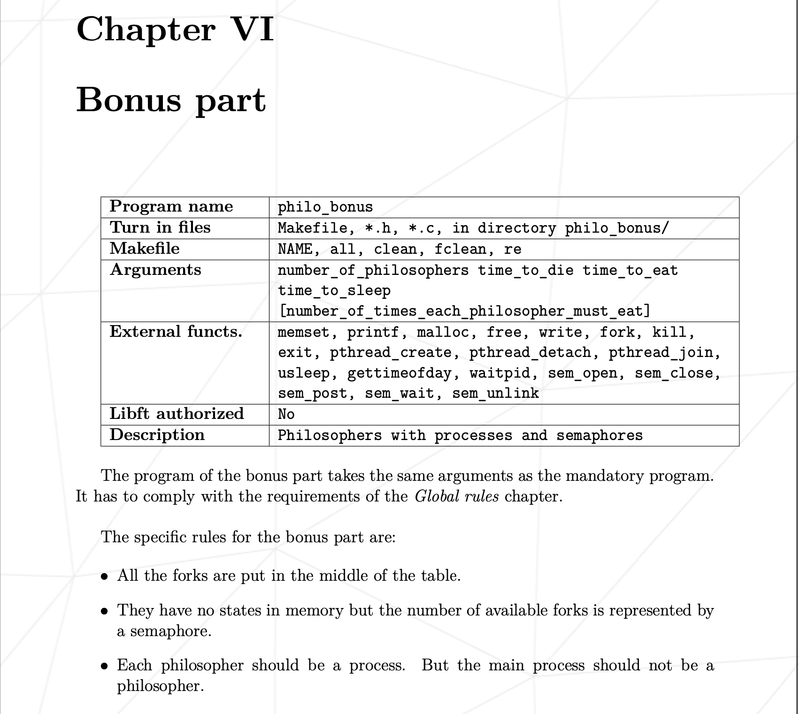
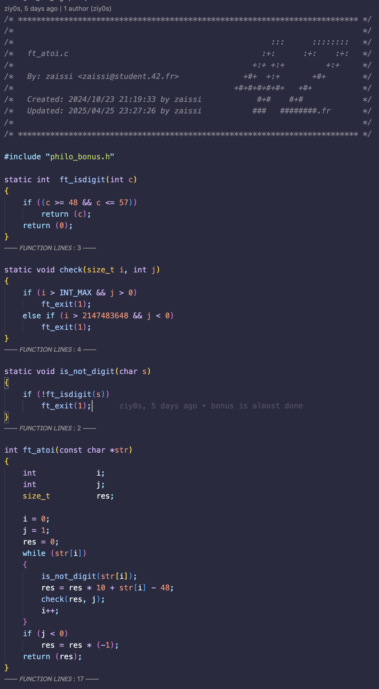
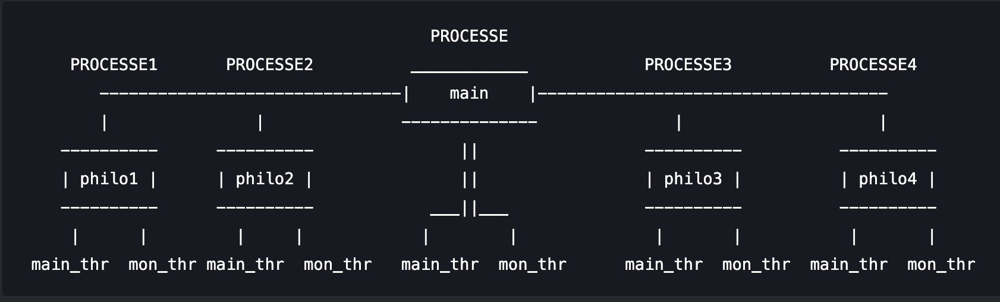

# PHILOSOPHER [BONUS](../philosopher_sub.pdf)

## TASKS

> #### 1. what should we do ? [ℹ️](#1-what-we-should-to-do-)
> #### 2. Learn [ℹ️](#2-learn)
> #### 3. Program work strategy and start coding ;)[ℹ️](#3-program-work-strategy-and-start-coding-)

<!-- <a id="task1"></a> -->
## 1. what should we do ?
first we need to know what we should to do it , we can't work without this !.
Okey , let't starting with the [subject](../philosopher_sub.pdf) exactly on the bonus part 
- The program, source code and Makefile it's moust be in `philo_bonus` directory on home working directory !
- Argument's it's like the mandatory args !
- Allowed functions :
	<a id="functions"></a>
```
memset, printf, malloc, free, write, fork, kill, exit, pthread_create, pthread_detach, pthread_join,
usleep, gettimeofday, waitpid, sem_open, sem_close, sem_post, sem_wait, sem_unlink
```
- LIBFT is not allowed !
- We should to working with processes and semaphores in this part, which means we need to build program like the Mandatory's program but we need replace the threads with processes and mutex with semaphore!
- Special rules for bonus part :
	<a id="rule1"></a>
	1. All the forks are put in the middle of the table.
	<a id="rule2"></a>
	1. They have no states in memory but the number of available forks is represented by a semaphore.
	<a id="rule3"></a>
	1. Each philosopher should be a process. But the main process should not be a philosopher.
So we need to creat program accept same args of Mandatory's program (`./philo_bonus [number_of_philo] [time_to_die_in_ms] [time_to_eat_in_ms] [time_to_sleep_in_ms] | [number_of_each_philo_must_eat]`). we need to creat multiple processes each process is a philo , so if we see number of process we run it we should to see the number of philosophers plus one 'main program'[rule N`3](#rule3). And we have same rules of Mandatory part 'same output, no data race or death lock ...'

<!-- <a id="task2"></a> -->
## 2. Learn
First let's look what is process, semaphore, diff between processes and threads, how to creat a process, how to work with time in C and breakdown the allowed functions.
1. #### What is process ?
- Process is a <mark>program in execution</mark>, for example when we write a C program and compile it and run it ,it becomes a process.
- each process have a memory space call it **<mark>address space</mark>** or **<mark>virtual address space</mark>**. Memory in one process **cannot directly access or modify** the memory of another process (unless explicitly shared via IPC mechanisms).
- each process has several important attributes that help the operating system manage and control it, these attributes stored in a structure called the **Process Control Block (PCB)**. We can see some of them if we put `ps aux` in terminal, we can see multiple info about all processes run by CPU like the owner of the process 'user', PID and how much resources are used ...
[source](https://www.geeksforgeeks.org/process-in-operating-system/)
	<a id="type of process"></a>
- There are two types of process
	+ Independent process: is not affected by the execution of other processes. Independent processes do not share any data or resources with other processes.
	+ Co-operating process: Interact with each other and share data or resources. A co-operating process can be affected by other executing processes.
[source](https://www.geeksforgeeks.org/cooperating-process-in-operating-system/)

2. #### what is semaphore ?
- The semaphore is a **mechanism in IPC mechanisms**. let's see what is IPC:
as we said before [type of process](#type_of_porcess), there are two type of process, **Independent process** and **Co-operating process**, in dining philosopher problem we need to work with the second type 'Co-operating'. In this type The are some thing call it **IPC (Inter-Process Communication)**. this IPC allowed diff processes running on a computer to share informations with each other.
It ensures that processes can work together without interfering with each other. 
The IPC (Inter-Process Communication) is a set of methods for processes to :
	+ Share data (e.g., variables, resources).
	+ Synchronize actions (e.g., avoid race conditions).
	+ Communicate .
					<a id="sem"></a>
- they are two type of semaphore :
	+ Binary Semaphore : it like mutex but the are diff between mutex and binary semaphore, it's allow one thread/process to access the resource or protect the critical section, it's have two value 1 or 0
		* how it's work : it like
		```C
		sem_wait()
		|_ while (i == 0) // if i == 0 it's wait to i != 0
		|___ // nothing after while
		|_ i -= 1;
		sem_post()
		|_ i += 1;
		```
	+ Counting Semaphore : can we use it to allow multiple threads/processes to access the resource or protect the critical section, it's have N value (N >= 0)
		* how it's work : it's like binary semaphore
		```C
		sem_wait()
		|_ while (i == 0)
		|_ i -= 1
		sem_post()
		|_ i += 1
		```
- Critical Section: is the code between sem_wait and sem_post
- We use `sem_open()` function to open file in `/dev/shm/` to allowed multiple process to access same semaphore, we need to add `sem_unlink()` to removet from system after close it.
[source](https://www.geeksforgeeks.org/semaphores-in-process-synchronization/)

3. #### diff between threads and processes
| process | thread |
| :-----: | :----: |
| program is execute | segment of a process|
| It takes more time for creation | It takes less time for creation |
| less efficient in terms of communication | more efficient in terms of communication |
| **Every process runs in its own memory** | **Threads share memory** |
| A process does not share data with each other | Threads share data with each other |

[source](https://www.geeksforgeeks.org/difference-between-process-and-thread/)

4. #### How to creat process
- We know the process is a program when it execute, so let't change this titile to **<mark>How to creat process in side process</mark>**
- in C there function call **fork()**, is a system call, it's allowed use to creat multiple process in side main process, we call the main process **Parent** and we call the processes created by fork() **child**.
- the fork() function return a integer value in the parent process the value is the process ID of the child process and 0 in the child process. in otherwise it return -1 'for any error' is returned to the parent process.
- the fork() function it failed and no child process will be created if :
	* The system-imposed limit on the total number of processes under execution would be exceeded. this limit is configuration-dependent. you can use `ulimit -u` to get max processes you computer can be created. (`in system`) macros -> [EAGAIN]
	* The system-imposed limit MAXUPRC (<sys/param.h>) on the total number of processes under exection by a single user would be exceeded. (`in process`) macros -> [EAGAIN]
	* There is insufficient swap space for the new process. macros -> [ENOMEM]
[source](https://man.openbsd.org/fork.2)

5. #### How to work with time in C
- We have multiple function can use it for working with time in C lang, like time(), *gettimeofday()*, clock_gettime(), *usleep()* and sleep() ....
- We have the **gettimeofday()** and **usleep()** in the allowed functions, so let's see how we can work with time using this function :
	* gettimeofday(): it's can get the time and the time zone. we give it a <mark>struct timeval</mark> and <mark>struct timezone</mark> by reference, it will modifie it and restore the info about time. it give time from 1970 to now by seconds and microseconds '*microsecond for the rest of the second*'
		+ struct timeval: it's a struct contains a two variables, **tv_sec** as a long it's the seconds and **tv_usec** as a int it's the microseconds. it return 0 for success and -1 for error.
		[source](https://www.geeksforgeeks.org/measure-execution-time-with-high-precision-in-c-c/)
		in [subject PDF](../philosopher_sub.pdf) they want time in milliseconds, so we need to learn how to get it by gettimeofday function, we know gettimeofday() modifie in the timeval struct and put seconds in tv_sec and microseconds in tv_usec, so
		```
		seconds		-[ x 1000]->	milliseconds
		microseconds	-[ / 1000]->	milliseconds
		```
		[source](https://stackoverflow.com/questions/10192903/time-in-milliseconds-in-c)
	* usleep(): it's suspends thread execution for the number of microseconds specified by the useconds argument. Because of other activity, or because of the time spent processing the call, the actual suspension time may be longer than the amount of time specified. it return 0 if successful or -1 in error. like what I told before the subject need us work by milliseconds not microseconds, so we need to learn how to make usleep to sleep by milliseconds. so we will have to multiply the input by 1000 in order to sleep in milliseconds.
	[source](https://stackoverflow.com/questions/1157209/is-there-an-alternative-sleep-function-in-c-to-milliseconds)

6. #### Breakdown the allowed functions
##### memset(): 
it's accept a void pointer `void *b` and intiger `int c` and unsigned long as last args `size_t len`, it's writes len bytes of value c to string b. It's return a void pointer. **I don't use it in my project**.
```C
					void *memset(void *b, int c, size_t len);
							   |      |	     |
	    	string will be write on it_________________|      |	     |_______________ the number of byte it will
  								  |				write it by.
								  |
						          source of bytes
```
##### printf():
utility formats and prints its arguments. **I use it to print the output on screen**.
##### malloc():
functions allocate memory (heap). **I use it to share variables between my functions**.
##### free():
reverse of malloc(), it deallocates the memory allocation by malloc(). **I use it to remove all leaks in my program**.
##### write():
it write data by byte len on fd. **I use it to write errors on stderr '2'**.
##### fork():
[here](#how-to-creat-process)
##### kill():
it function sends a signal to the processes specified by the pid. **I use it to send SIGKILL '9' to child processes to kill them**.
```C
					int	kill(pid_t pid, int sig);
							    |	     |
		PID of the process to send signal to it ____|	     |______________ integer between 1 and 31
```
+ Signals:
	| signal | value | macros |
	| :----: | :---: | :----: |
	| hang up | 1 | HUP |
	| interrupt | 2 | INT |
	| quit | 3 | QUIT |
	| abort | 6 | ABRT |
	| non-catchable, non-ignorable kill | 9 | KILL |
	| alarm clock | 14 | ALRM |
	| software termination signal | 15 | TERM |
you can put `kill -l` in terminal to show all signals !!.
##### exit():
function terminate a process with status code. **I use it to exit from my program if anything goes wrong**.
##### pthread_create():
Creates a new thread and starts execution. Takes a function pointer that will be executed in the new thread. [here](../philo/Readme.md) **I use it to create a thread call it monitor to monitor all processes (philosophers) if any philo die the program will be terminated**.
```C
				int	pthread_create(pthread_t *thread, const pthread_attr_t *attr, void *(*start_routine)(void *), void *arg);
								    |				 |		    |			     |
A pointer to a pthread_t 					    |				 |		    |			     |___________ void to arg it will
variable where the function will				    |				 |		    |					   pass it to new thread.
store the identifier of the 					    |				 |		    |__ pointer to function, it will be
newly created thread. This 	____________________________________|				 |			 run it by the new thread.
identifier can be used for									 |
subsequent operations on the					A pointer to a pthread_attr_t structure that specifies
thread, such as joining or canceling.			attributes for the new thread, such as stack size,
												scheduling policy, and detach state. If set to NULL,
												the thread is created with default attributes.

```
it return 0 in success and -1 in error .
##### pthread_detach():
this function used to indicate that a thread's resources can be **automatically reclaimed** by the system upon its termination, without the need for another thread to call pthread_join(). if we don't use it or pthread_join(), its resources remain allocated, leading to a **<mark>memory leak</mark>**.
```C
							int pthread_detach(pthread_t thread);
											|_________ pthread_t variable when store the identifier about the thread.
```
return 0 in success and -1 in error.
##### pthread_join():
Waits for the specified thread to terminate. It blocks the calling thread until the target thread finishes.
```C
					int pthread_join(pthread_t thread, void **value_ptr);
								      |		      |
		pthread_t variable when				      |		      |___________ the return value from the thread
		store the identifier about the thread ________________|
```
return 0 in success and -1 in error.
##### usleep():
[time in C](#how-to-work-with-time-in-c)
##### gettimeofday():
[time in C](#how-to-work-with-time-in-c)
##### waitpid():
is a system call that allows a parent process to wait for and retrieve the termination status of a specific child process. It's particularly useful when a parent has multiple child processes and needs to wait for a particular one to finish.
```C
						pid_t waitpid(pid_t pid, int *status, int options);
			Specifies which child			     |		|	     |
			process to wait for	_____________________|		|	     |_____________ Modifiers that affect the behavior of waitpid().
										|				*we use 0 for default behavior.*
										|
								Pointer to an integer where the exit status
									of the child is stored.
```
- Key Macros for Analyzing `status`:
	After waitpid() returns, you can use the following macros to interpret the child's termination status:
	`WIFEXITED(status)`: Returns true if the child terminated normally (e.g., by calling exit() or returning from main()).
	`WEXITSTATUS(status)`: Returns the exit status of the child. This macro should only be used if WIFEXITED(status) is true.
	`WIFSIGNALED(status)`: Returns true if the child process was terminated by a signal.
	`WTERMSIG(status)`: Returns the signal number that caused the child process to terminate.
	`WIFSTOPPED(status)`: Returns true if the child process is currently stopped.
	`WSTOPSIG(status)`: Returns the signal number that caused the child process to stop.​
- Important Considerations:
	* Zombie Processes: If a parent process doesn't call wait(), waitpid(), or similar functions to reap its terminated child processes, those children become zombie processes, consuming system resources.
##### sem_open():
is used to create or open a named POSIX semaphore, which is a synchronization mechanism that can be shared between processes. This is particularly useful for coordinating access to shared resources in multi-process applications.
```C
						sem_t *sem_open(const char *name, int oflag, mode_t mode, unsigned int value);
									     |	        |	     |			 |
	A string that names the semaphore.				     |		|	     |			 |
	It must begin with a slash (/) and contain __________________________|		|            |			 |
	no additional slashes.								|            |		  The initial value
											|	     |		  for the semaphore.
											|	     |
							Flags that determine the _______|	     |
							behavior of the function.		     |
												The permissions to
												be applied to the semaphore
```
it return the semaphore descriptor to the calling process if success, otherwise return SEM_FAILED on error.
##### sem_close():
Closes the semaphore descriptor in the **calling process**.(calling process is the main process it create process and semaphore)
```C
						int	sem_close(sem_t *sem);
									  |
									  |
									  |___________________ Indicates the semaphore to be closed.
```
Upon successful completion, 0 is returned. Otherwise, -1 is returned and errno is set to indicate the error.
#### sem_post():
[here](#sem) represents the critical section that should not be concurrently accessed by multiple processes.
#### sem_wait():
[here](#sem) Decrements the semaphore. If the semaphore's value is zero, the call blocks until the value becomes greater than zero.
#### sem_unlink():
Removes the named semaphore from the system. This is necessary to clean up resources.
## 3. Program work strategy and start coding ;)
- So, through what we have learned a clear strategy will emerge. This is my work strategy:
first we need to create a two struct, one for all data shared by each philosopher like number of philosopher, time to eat, time to die and the semaphores, and second for each philosopher like eating number, pid, and is philo die or not.
```C
		typedef struct s_philo
		{
			int		id;		// id for each philo
			int		pid;		// pid for each philo
			int		num_eats;	// number of eat
			int64_t		eat_time;	// the last time to eat
			struct s_data	*data;		// for shared data
		}		t_philo;

		typedef struct s_data
		{
			int		num_philos;		// number of philosophers
			int		num_meals;		// number of each philo should eat
			int64_t		time_to_die;		// time to die
			int64_t		time_to_eat;		// time to eat
			int64_t		time_to_sleep;		// time to sleep					   |------> fork1
			int64_t		start_time;		// time when program starting				   |------> fork2
			sem_t		**sem_forks;		// pointer to each fork for each philo ; 5 philos => fork -|------> fork3
			sem_t		*sem_print;		// share semaphore for manage the output		   |------> fork4
			sem_t		*sem_stop;		// share semaphore for stop simulation			|------> fork5
			t_philo		**philos;		// refernce for each philosopher
		}				t_data;
```
then we need to handler the user input, the program it should accept four or five args `[number of philosopher] [time to die] [time to eat] [time to sleep] '[number of each philo should eat]'` , all this args are numbers so we need to use `ft_atoi` and it will be accept integer value. In correction sheet the max number of philosopher is 200 and time to die, time to eat, time to sleep should be > 60, so we should to handle this.
* **Summary:**
	+ number of args : 4 or 5
	+ all args is integers
	+ number of philosopher <= 200
	+ time to die >= 60
	+ time to eat >= 60
	+ time to sleep >= 60


- Now we need to initialize `t_data` and `t_philo` and check each args

- After initialize `t_data` and `t_philo` we need to create processes 'philosophers' like the number of philosopher, so we need to use `fork()` and save pid of each child process to use it for send signales to it and start simulation, 
- We need to add one more thread in each child process to manager it. If some philo is die. And one more thread in the main process for stoping simulation if anything goes wrong.
##### Visualizer:
- If the number of philosopher is 4:

- In the end or anything goes wrong, we need to close semaphores and unlink it and free the memory allocated.
```C
void	cleanup(t_data *data, int s)
{
	int	i;

	if (!data)
		ft_exit(1);
	sem_post(data->sem_stop);				// unlock the sem stop , because it will hunging when we close it sem_close(data->sem_stop);
	sem_close(data->sem_print);
	sem_unlink(data->print);
	sem_close(data->sem_stop);
	sem_unlink(data->stop);
	i = 0;
	while (i < data->num_philos)
	{
		sem_close(data->sem_forks[i]);
		sem_unlink(data->forks[i]);
		i++;
	}
	ft_exit(s);
}
```
###### THE END `happy coding ;)`
